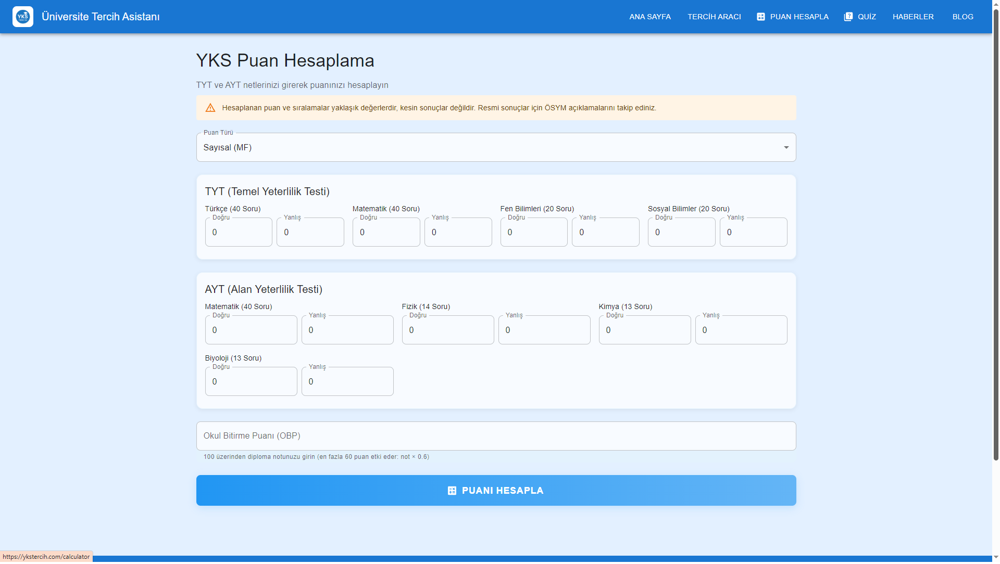
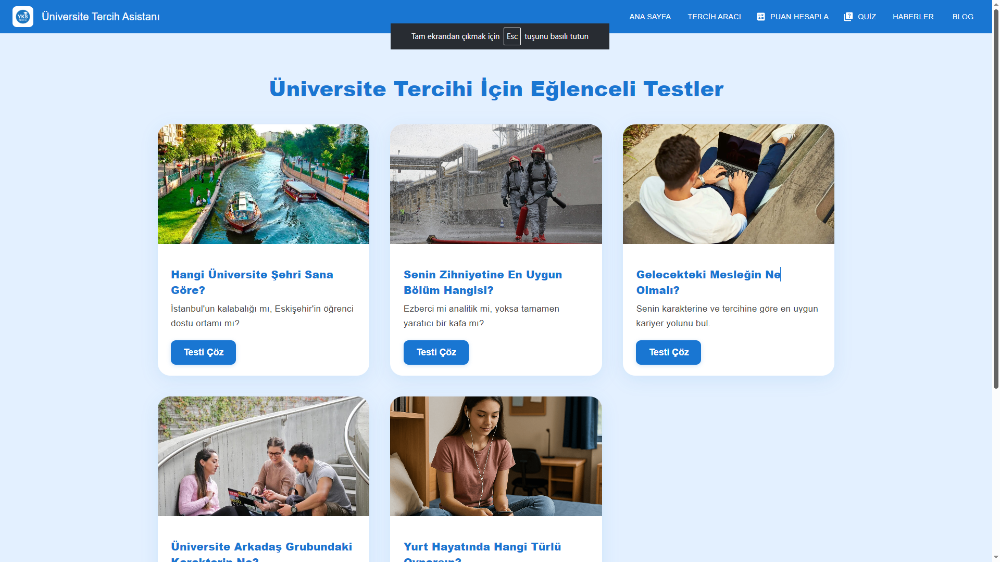
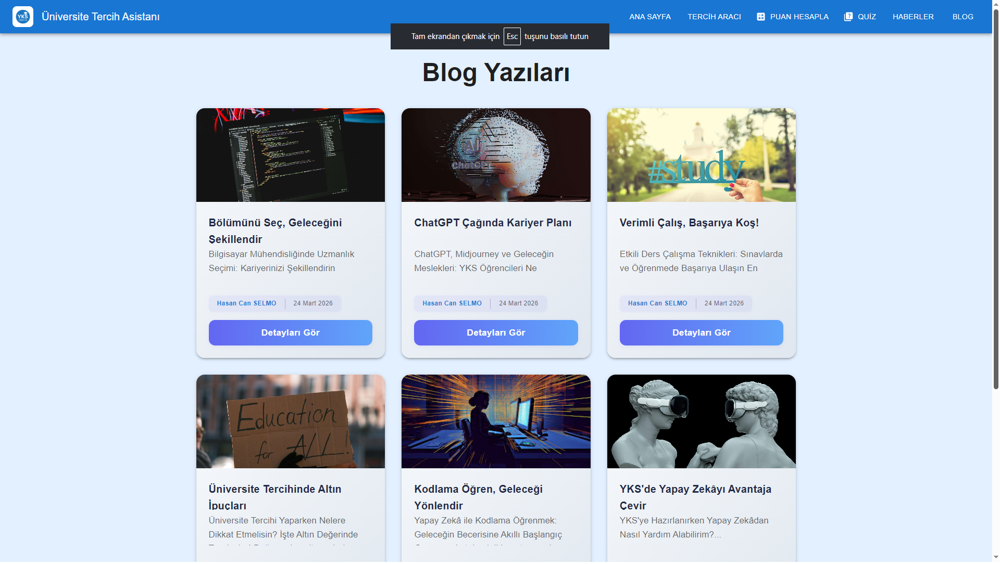
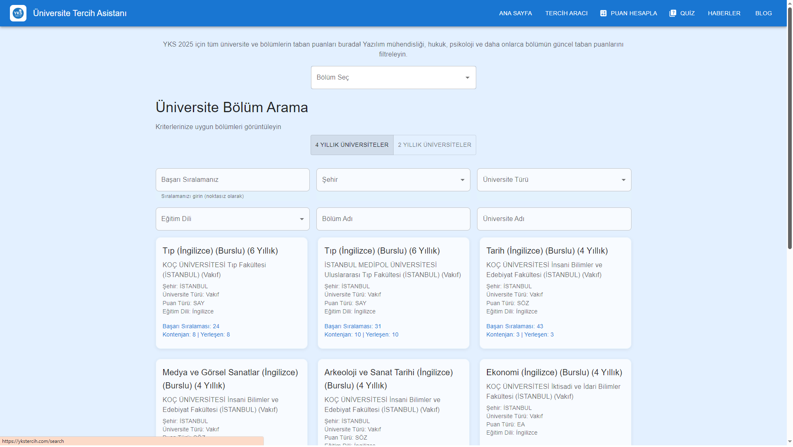

# YKSTercih.com - University Choice Guide & Student Platform

*This repository contains the source code for [ykstercih.com](https://ykstercih.com), a live production web application. It is shared here solely as a portfolio piece to showcase the architecture and code quality for job applications.*

This project is a comprehensive guide platform developed for students preparing for the Turkish Higher Education Institutions Examination (YKS). It is designed to help students navigate their university choices easily while offering interactive Question & Answer games to relieve exam stress.

## 🚀 Key Features

- **University Base Scores:** Up-to-date base scores, success rankings, and quota information for universities and departments across Turkey.
- **Education News:** The latest news and announcements closely related to university candidates.
- **Interactive Q&A Games:** Fun and interactive quizzes designed to reinforce learning and help students cope with exam anxiety.
- **User-Friendly Interface:** A modern and responsive design that enables candidates to access the information they need in the fastest and easiest way possible.

## 🛠️ Built With

- **Frontend Framework:** React, Vite
- **Package Manager:** npm

## 🔗 Live Demo
The project is currently live in production. You can access the working application and see it in action at: **[ykstercih.com](https://ykstercih.com)**

## 📸 Screenshots

Here is a glimpse of the application interface:






## 💻 Running Locally

To run the source code on your local machine:

```bash
# Clone the repository
git clone https://github.com/your-username/university_2025.git

# Navigate into the project directory
cd university_2025

# Install the dependencies
npm install

# Start the development server
npm run dev
```

---
*Developed by: [Your Name Here] - Shared for review by technical recruiters and engineering managers.*
